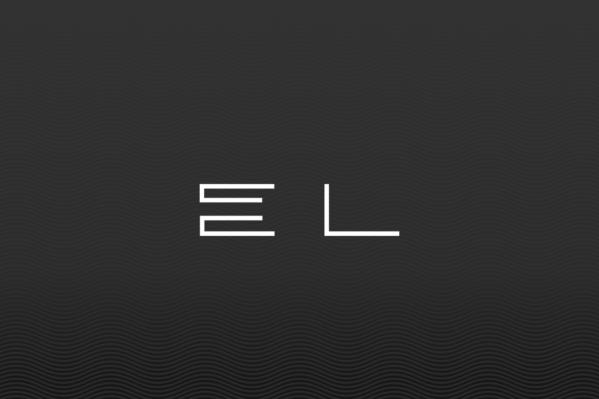

<!-- PROJECT SHIELDS -->
<!--
*** I'm using markdown "reference style" links for readability.
*** Reference links are enclosed in brackets [ ] instead of parentheses ( ).
*** See the bottom of this document for the declaration of the reference variables
*** for contributors-url, forks-url, etc. This is an optional, concise syntax you may use.
*** https://www.markdownguide.org/basic-syntax/#reference-style-links
-->
<div align="center">
  
  [![LinkedIn][linkedin-shield]][linkedin-url]
  
</div>


<!-- PROJECT LOGO -->
<br />
<div align="center">
  <a href="https://github.com/lout8/techins-task">
    
  </a>

  <h3 align="center">Techins Task</h3>

  <p align="center">
    <br />
    <br />
    <a href="https://elissaios-loutos.netlify.app/projects">View Website</a>
    ·
    <a href="https://github.com/lout8/techins-task/issues">Report Bug</a>
    ·
    <a href="https://github.com/lout8/techins-task/issues">Request Feature</a>
  </p>
</div>


<!-- TABLE OF CONTENTS -->
<details>
  <summary>Table of Contents</summary>
  <ol>
    <li>
      <a href="#about-the-project">About The Project</a>
      <ul>
        <li><a href="#built-with">Built With</a></li>
      </ul>
    </li>
    <li>
      <a href="#getting-started">Getting Started</a>
      <ul>
        <li><a href="#prerequisites">Prerequisites</a></li>
        <li><a href="#installation">Installation</a></li>
      </ul>
    </li>
    <li><a href="#license">License</a></li>
    <li><a href="#contact">Contact</a></li>
  </ol>
</details>


<!-- ABOUT THE PROJECT -->
## About The Project

This is a portfolio website that developed with next.js and tailwind CSS. 
 
What the website provides:
* Home page
* Informations and skills page
* Projects page
* Contact info page

<p align="right">(<a href="#top">back to top</a>)</p>


### Built With
  
  * [![Next][Next.js]][Next-url] 
  * [![JavaScript][JavaScript]][JavaScript-url]
  * [![HTML5][HTML5]][HTML5-url]
  * [![CSS3][CSS3]][CSS3-url]
  * [![Tailwind CSS][Tailwind-CSS]][Tailwind-CSS-url]
  * [![Figma][Figma]][Figma-url]
  * [![Web3Form][Web3Form]][Web3Form-url]
  

<p align="right">(<a href="#top">back to top</a>)</p>


<!-- GETTING STARTED -->
## Getting Started

This is an example of how you may give instructions on setting up your project locally.
To get a local copy up and running follow these simple example steps.

### Prerequisites

This is an example of how to list things you need to use the software and how to install them.
* npm
  ```sh
  npm install npm@latest -g
  ```

### Installation

2. Clone the repo
   ```sh
   git clone https://github.com/your_username_/Project-Name.git
   ```
3. Find the path
   ```sh
   cd path file
   
   example: cd ./Desktop/personal-website
   ```
4. Install npm locally
   ```sh
   npm install
   ```
5. Local run
   ```js
   npm start
   ```

<p align="right">(<a href="#top">back to top</a>)</p>


<!-- CONTACT -->
## Contact

Elissaios Loutos - e.loutos8@gmail.com

Project Link: [https://github.com/lout8/techins-task](https://github.com/lout8/techins-task)

<p align="right">(<a href="#top">back to top</a>)</p>


<!-- MARKDOWN LINKS & IMAGES -->
<!-- https://www.markdownguide.org/basic-syntax/#reference-style-links -->
[license-shield]: https://img.shields.io/github/license/othneildrew/Best-README-Template.svg?style=for-the-badge
[license-url]: https://github.com/lout8/personal-website/blob/master/LICENSE.txt
[linkedin-shield]: https://img.shields.io/badge/-LinkedIn-black.svg?style=for-the-badge&logo=linkedin&colorB=555
[linkedin-url]: https://www.linkedin.com/in/elissaios-loutos-695024227/

[Next.js]: https://img.shields.io/badge/Next-20232A?style=for-the-badge&logo=next.js&logoColor=f4f5f7
[Next-url]: https://nextjs.org/
[JavaScript]: https://img.shields.io/badge/JavaScript-323330?style=for-the-badge&logo=JavaScript&logoColor=F0DB4F
[JavaScript-url]: https://www.javascript.com
[HTML5]: https://img.shields.io/badge/HTML-e34c26?style=for-the-badge&logo=html5&logoColor=000000
[HTML5-url]: https://www.w3.org/html/
[CSS3]: https://img.shields.io/badge/CSS-264de4?style=for-the-badge&logo=css3&logoColor=000000
[CSS3-url]: https://www.w3.org/Style/CSS/Overview.en.html
[Tailwind-CSS]: https://img.shields.io/badge/styled%20components-20232A?style=for-the-badge&logo=tailwindcss&logoColor=#0284c7
[Tailwind-CSS-url]: https://tailwindcss.com/
[Figma]: https://img.shields.io/badge/Figma-20232A?style=for-the-badge&logo=figma&logoColor=#FF0000
[Figma-url]: https://www.figma.com/
[Web3Form]: https://img.shields.io/badge/Web3Forms-20232A?style=for-the-badge&logo=Web3Forms&logoColor=#FF0000
[Web3Form-url]: https://web3forms.com/
